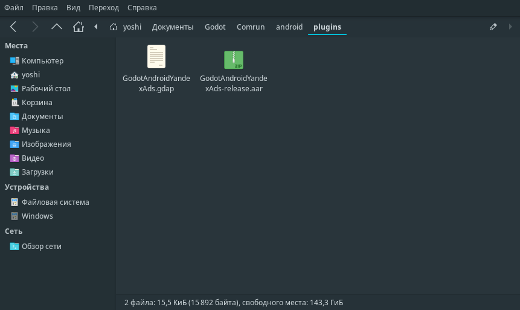
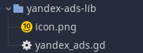
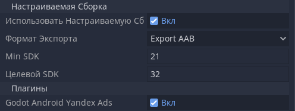

# Godot YandexAdsAndroid
This plugin is designed to connect Yandex advertising to godot.

## Instruction

### 1. Downloading
Download and unpack this archive.


### 2. Distribution by files
Move the contents of the 'yandex-plugin' folder to /android/plugins.



Move the 'yandex-ads-lib' folder to your project.



### 3. Project Setup
In the project export, specify a custom build and plugins.



Next, create a node for the advertising module where you need it.


And insert the ID of your ad.


In build.gradle the module file of your application add the following code:
```
dependencies {
    ...
    implementation 'com.yandex.android:mobileads:5.5.0'
}
```

```
android {

    compileOptions {
        sourceCompatibility JavaVersion.VERSION_1_8
        targetCompatibility JavaVersion.VERSION_1_8
    }
}
```

Then you can use the signals and functions written in the script to display ads.


```
func _on_CoinPlus_pressed():
	$Yandex.load_rewarded_video()
  
func _on_Yandex_rewarded_video_loaded():
	$Yandex.show_rewarded_video()
```
