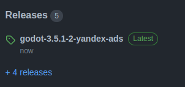
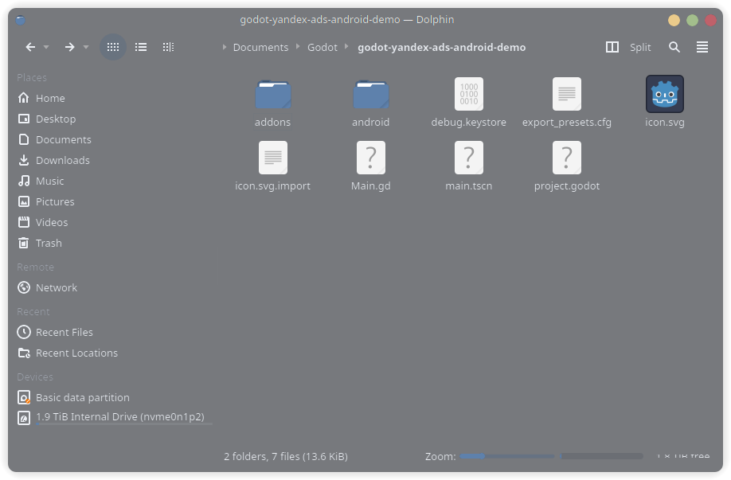
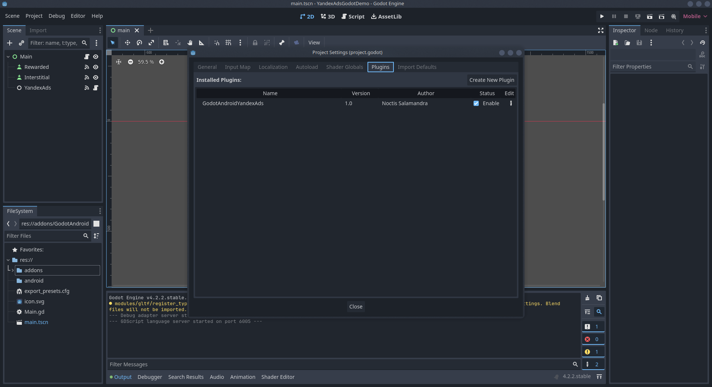
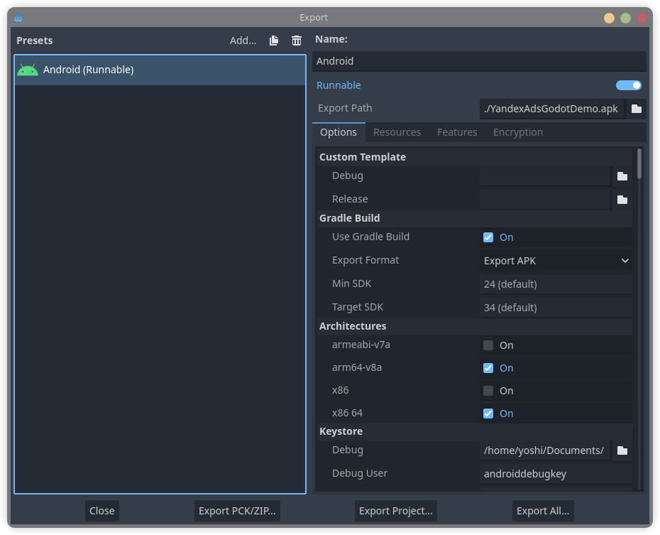
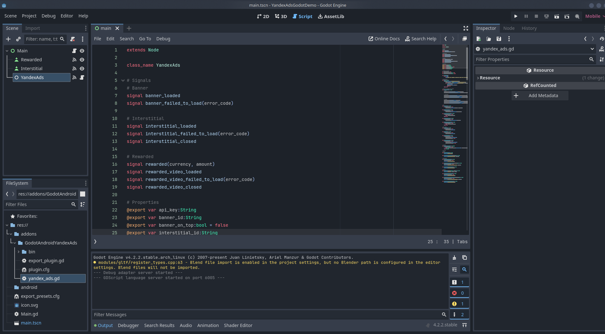
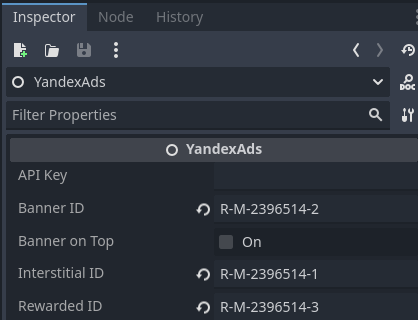
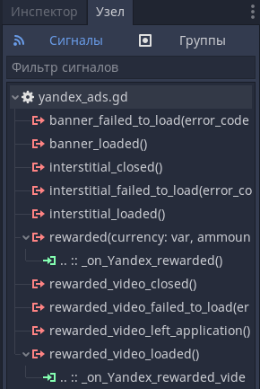

# Godot Android Yandex Ads

[🇷🇺 Русская версия](README.ru.md)

Android plugin for [Godot 4](https://godotengine.org/) that integrates [Yandex Mobile Ads SDK](https://yandex.ru/dev/mobile-ads/).

Supports banner, interstitial, and rewarded video ads.

> Only works on Android. On other platforms the plugin gracefully does nothing.

## Requirements

- Godot 4.x
- Android export with Gradle build enabled

---

## Installation

### 1. Download

Download and unpack the latest [release archive](https://github.com/noctisalamandra/godot-yandex-ads-android/releases/latest).



### 2. Add to project

Copy the `addons/GodotAndroidYandexAds` folder into the root of your Godot project.



### 3. Enable the plugin

Open `Project → Project Settings → Plugins` and enable **GodotAndroidYandexAds**.



### 4. Configure Android export

In the export settings:
- Enable **Use Gradle Build**



- Under **Permissions**, enable `Access Network State` and `Internet`

### 5. Configure Gradle

In `android/build/build.gradle`, add the following inside the `android {}` block:

```groovy
android {
    compileOptions {
        sourceCompatibility JavaVersion.VERSION_17
        targetCompatibility JavaVersion.VERSION_17
    }
}
```

### 6. Add the node

Create a Node in your scene and attach the `yandex_ads.gd` script from the plugin folder.



---

## Configuration

The `YandexAds` node exposes the following exported properties:

| Property | Type | Description |
|---|---|---|
| `api_key` | `String` | AppMetrica API key (optional, for analytics) |
| `banner_id` | `String` | Ad unit ID for banner ads |
| `banner_on_top` | `bool` | Show banner at top (`true`) or bottom (`false`, default) |
| `banner_width` | `int` | Fixed banner width in dp (0 = sticky/adaptive) |
| `banner_height` | `int` | Fixed banner height in dp (0 = sticky/adaptive) |
| `interstitial_id` | `String` | Ad unit ID for interstitial ads |
| `rewarded_id` | `String` | Ad unit ID for rewarded video ads |

Set the ad unit IDs in the Inspector:



---

## API

### Methods

#### Banner

```gdscript
load_banner() -> void          # Load and display the banner
show_banner() -> void          # Show a previously hidden banner
hide_banner() -> void          # Hide the banner (keeps it in memory)
get_banner_dimension() -> Vector2  # Returns banner size in pixels
```

#### Interstitial

```gdscript
load_interstitial() -> void         # Load an interstitial ad
show_interstitial() -> void         # Show the loaded interstitial
is_interstitial_loaded() -> bool    # Check if interstitial is ready
```

#### Rewarded Video

```gdscript
load_rewarded_video() -> void         # Load a rewarded video ad
show_rewarded_video() -> void         # Show the loaded rewarded video
is_rewarded_video_loaded() -> bool    # Check if rewarded video is ready
```

### Signals



#### Banner

| Signal | Arguments | Description |
|---|---|---|
| `banner_loaded` | — | Banner loaded successfully |
| `banner_failed_to_load` | `error_code: int` | Banner failed to load |

#### Interstitial

| Signal | Arguments | Description |
|---|---|---|
| `interstitial_loaded` | — | Interstitial loaded successfully |
| `interstitial_failed_to_load` | `error_code: int` | Interstitial failed to load |
| `interstitial_closed` | — | User closed the interstitial |

#### Rewarded Video

| Signal | Arguments | Description |
|---|---|---|
| `rewarded_video_loaded` | — | Rewarded video loaded successfully |
| `rewarded_video_failed_to_load` | `error_code: int` | Rewarded video failed to load |
| `rewarded_video_closed` | — | User closed the rewarded video |
| `rewarded` | `currency: String, amount: int` | U
ser earned a reward |

---

## Usage Example

```gdscript
extends Node

func _ready():
    # Connect signals
    $YandexAds.banner_loaded.connect(_on_banner_loaded)
    $YandexAds.banner_failed_to_load.connect(_on_banner_failed_to_load)
    $YandexAds.interstitial_loaded.connect(_on_interstitial_loaded)
    $YandexAds.rewarded_video_loaded.connect(_on_rewarded_video_loaded)
    $YandexAds.rewarded.connect(_on_rewarded)

    # Load banner immediately
    $YandexAds.load_banner()

func _on_banner_loaded():
    $YandexAds.show_banner()

func _on_banner_failed_to_load(error_code):
    print("Banner failed: ", error_code)

# Call this when you want to show an interstitial
func show_interstitial_ad():
    if $YandexAds.is_interstitial_loaded():
        $YandexAds.show_interstitial()
    else:
        $YandexAds.load_interstitial()

func _on_interstitial_loaded():
    $YandexAds.show_interstitial()

# Call this when you want to show a rewarded video
func show_rewarded_ad():
    if $YandexAds.is_rewarded_video_loaded():
        $YandexAds.show_rewarded_video()
    else:
        $YandexAds.load_rewarded_video()

func _on_rewarded_video_loaded():
    $YandexAds.show_rewarded_video()

func _on_rewarded(currency: String, amount: int):
    print("Reward earned: %d %s" % [amount, currency])
    # Grant the reward to the player here
```

---

## Demo project

A full example project is available [here](https://github.com/noctisalamandra/godot-yandex-ads-android-demo).

## License

[MIT](LICENSE)
